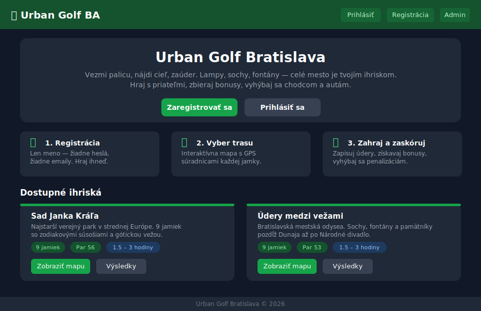
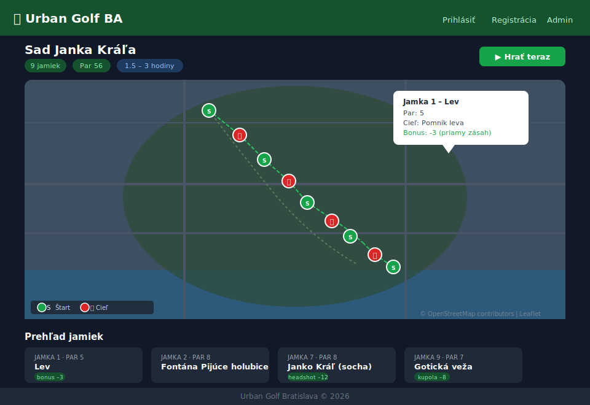
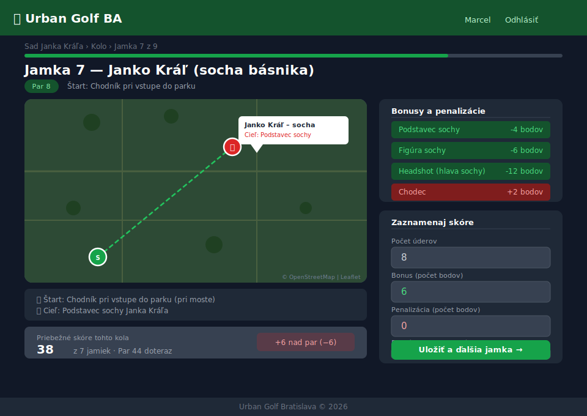
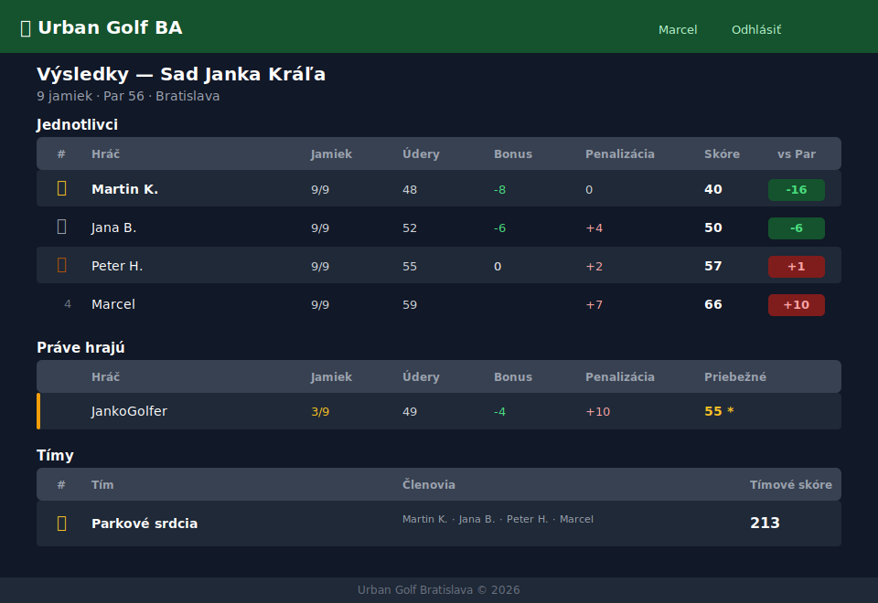

<div align="center">

# ⛳ Urban Golf Bratislava

**The city is your course. Statues, fountains, lamp posts — everything is a target.**

[](https://golf.suflik.eu)
[](https://python.org)
[](https://flask.palletsprojects.com)
[](https://leafletjs.com)

> **Play it now →** [golf.suflik.eu](https://golf.suflik.eu)

</div>

---

## What is Urban Golf?

Urban Golf is a street sport that transforms city landmarks into a golf course. Forget manicured greens — your fairway is a cobblestone square, your hole is a sculptor's pedestal, and your hazard is a passing tram or an unsuspecting pedestrian.

**You play with a real ball** — a lightweight plastic or rubber-foam ball chosen specifically for safety in urban environments — and a golf club (or any improvised equivalent). From each designated start point, players take turns hitting towards the target: a statue, a fountain edge, a trash can, or any other urban object chosen by the course designer. Fewest strokes wins. Bonus precision shots reward the brave. Penalties keep things honest.

Urban Golf Bratislava is both the sport and the platform that powers it. This web application lets groups of friends organize, score, and compete across hand-crafted courses built from the real streets of Bratislava. Every hole has GPS coordinates, an interactive map, and a curated set of bonuses and penalties that make each round a unique mix of skill, improvisation, and laughter.

---

## Screenshots

<table>
<tr>
<td align="center" width="50%">

<br><sub><b>Home Page</b> — Browse courses, see how-to steps, resume in-progress rounds</sub>
</td>
<td align="center" width="50%">

<br><sub><b>Course Map</b> — All holes on an interactive Leaflet/OpenStreetMap with start and target markers</sub>
</td>
</tr>
<tr>
<td align="center" width="50%">

<br><sub><b>Scoring Screen</b> — Live map per hole, bonus targets, and stroke entry form</sub>
</td>
<td align="center" width="50%">

<br><sub><b>Leaderboard</b> — Individual rankings, live in-progress rounds, and team standings</sub>
</td>
</tr>
</table>

---

## Why Urban Golf?

Most sports require dedicated infrastructure — fields, courts, equipment rooms. Urban Golf requires none of that. The city already has everything: distances to navigate, obstacles to avoid, targets to hit, and spectators who didn't sign up to watch but end up cheering anyway.

Here is what makes it special:

- **Zero barrier to entry.** A lightweight ball, a club, and a phone. That's the full kit.
- **Every round is different.** Weather, pedestrian traffic, and your aim on that particular day all factor in.
- **It scales from two friends to a 20-person tournament.** The platform handles individual scores, live in-progress visibility, and full team competition out of the box.
- **Bratislava is perfect for it.** Pedestrian zones, park paths, riverside promenades, and a density of statues and sculptures that most cities can't match.

---

## Live Courses

Two full courses are live and playable today at [golf.suflik.eu](https://golf.suflik.eu):

### 🌳 Sad Janka Kráľa — 9 holes, Par 56

Slovakia's oldest public park becomes a zodiac-themed golf course. Each hole is named after a constellation sculpture or park monument, with targets ranging from lion paws to the head of a stone poet.

| # | Hole | Par | Target | Top Bonus |
|---|------|-----|--------|-----------|
| 1 | Lev (Lion) | 5 | Lion monument | -3 direct hit |
| 2 | Fontána Pijúce holubice | 8 | Fountain wall perimeter | — |
| 3 | Panna (Virgo) | 7 | Virgo zodiac sculpture | -3 zodiac sign |
| 4 | Blíženci (Gemini) | 4 | Gemini sculpture | -3 zodiac sign |
| 5 | Škorpión (Scorpio) | 8 | Scorpio sculpture | -3 zodiac sign |
| 6 | Vodnár (Aquarius) | 4 | Aquarius sculpture | -3 zodiac sign |
| 7 | Janko Kráľ (poet statue) | 8 | Statue base / head | -4 / -6 / **-12 headshot** |
| 8 | WC (Restroom) | 5 | WC marker lamp | **-12 logo hit** |
| 9 | Gotická veža (Gothic Tower) | 7 | Tower interior | -8 dome |

### 🏛️ Údery medzi vežami — 9 holes, Par 53

A walking tour of Bratislava's cultural heritage, disguised as a golf game. The route traces the Danube embankment from the Messerschmidt column past Imi Lichtenfeld, Ján Andrej Segnér, Mikuláš Moyzes, Hviezdoslav Square, and the Štúr memorial — ending at the Tanečnica fountain by the National Theatre.

| # | Hole | Par | Target | Top Bonus |
|---|------|-----|--------|-----------|
| 1 | Messerschmidt Square | 4 | Last column with bust | -3 bust hit |
| 2 | Imi Lichtenfeld Statue | 4 | Pedestal | — |
| 3 | Ján Andrej Segnér | 6 | Green square under bust | -7 bust hit |
| 4 | Mikuláš Moyzes | 5 | Monument | -8 bust |
| 5 | Smetný kôš (Trash Bin) | 6 | Trash bin | -7 lid hit |
| 6 | Hviezdoslavovo námestie | 7 | Centre of circle | — |
| 7 | Ľudovít Štúr Memorial | 7 | Pedestal | -7 statue |
| 8 | M. R. Štefánik | **10** | Statue pedestal | -7 Štefánik / **-25 lion** |
| 9 | Fontána Tanečnica | 4 | Fountain | -6 statue |

> **Hole 8 is 530 metres long with Par 10.** Good luck.

---

## Scoring System

Urban Golf uses a modified Stroke Play format with urban-specific bonuses and penalties.

| Event | Score effect |
|-------|-------------|
| Each stroke taken | +1 |
| Bonus: hit a specific target element | -2 to -12 |
| Penalty: ball hits a pedestrian | +2 |
| Penalty: ball hits a car | +1 |
| Penalty: ball lost | +5 to +50 (hole-specific) |
| Penalty: ball on path (forbidden zone) | +5 |

**The final score is:** `strokes + penalties − bonuses`

Lower is better. Negative total (under par) is the dream. Hitting the head of a poet statue from 40 metres earns you -12 and the respect of your entire group.

---

## Platform Features

### For Players

**Register in seconds** — username only, no email, no password. Open the app, type your name, play.

**Browse and study courses** — every course has a full interactive map with all holes displayed simultaneously. Green markers show starts, red flag markers show targets. Click any marker to see the hole name, par, and description before you arrive.

**Score hole by hole** — the play screen shows the relevant map section for the current hole, lists all active bonuses and penalties, and lets you enter strokes, bonus points, and penalty points. Progress is saved after each hole.

**Resume any time** — interrupted a round because of rain? The home screen shows your unfinished round with current score and hole progress. Continue exactly where you left off.

**Team play** — form a 4-player team. Team rankings aggregate each member's individual round score on the same course.

**Live leaderboard** — the leaderboard shows three live sections simultaneously:
- *Jednotlivci* — completed rounds ranked by total score with vs-par comparison
- *Práve hrajú* — in-progress rounds with current score (marked with `*`) visible to everyone
- *Tímy* — team cumulative standings

### For Admins

**Course builder** — create courses with name, description, and city. Each hole is defined with an interactive map click-to-set coordinate picker — click once for the start point, click again for the target. No manual coordinate entry required.

**Bonus/penalty manager** — attach as many bonus and penalty targets per hole as you like. Name them, write descriptions, set point values (negative for bonuses, positive for penalties). The system automatically colour-codes bonuses green and penalties red on every player-facing screen.

**Import / Export** — share entire courses as JSON files. Export any course with one click, import a JSON file to recreate it on any UrbanGolf instance. Perfect for expanding to new cities.

**Active/inactive toggle** — need to pull a course for maintenance? Deactivate it. Players won't see it until you flip it back on.

---

## Tech Stack

| Layer | Technology | Notes |
|-------|-----------|-------|
| Backend | Python 3 + Flask 3.1 | Application factory pattern, Blueprint routing |
| ORM | SQLAlchemy 2.0 + Flask-SQLAlchemy | Declarative models, cascading relationships |
| Database | SQLite | Zero-config, file-based — swap for Postgres with one config change |
| Templating | Jinja2 3.1 | Server-rendered HTML, no client-side framework |
| Styling | Tailwind CSS (CDN) | Dark theme, utility-first, responsive grid |
| Maps | Leaflet.js 1.9 + OpenStreetMap | Interactive maps, click-to-coordinate picking in admin |
| Auth | Flask sessions | Username-only, session-cookie based |

---

## Architecture Overview

The application follows a standard Flask Blueprint architecture with a single SQLite database:

```
app/
├── __init__.py          # Application factory — creates Flask app, initialises SQLAlchemy, registers Blueprints
├── models/
│   ├── player.py        # Player — name, created_at, rounds relationship
│   ├── team.py          # Team + TeamMember — 4-player teams via junction table
│   ├── course.py        # Course → Hole → BonusTarget — cascading deletes throughout
│   └── game.py          # Round → Score — one Score per Hole per Round, computed properties for total_score / vs_par
└── routes/
    ├── main.py          # Home page — active courses + in-progress rounds for logged-in player
    ├── player.py        # Registration, login, logout, team creation
    ├── game.py          # Course detail, start/continue/abandon round, play hole, round result, leaderboard
    └── admin.py         # Course CRUD, hole CRUD with coordinate picker, export JSON, import JSON
```

### Data Model

```
Player ──< Round >── Course ──< Hole ──< BonusTarget
   │          │
   └─< TeamMember >─── Team        Round ──< Score
```

- A `Round` belongs to one `Course`, one `Player`, and optionally one `Team`
- A `Score` is unique per `(Round, Hole)` — one score entry per hole per round
- `Round.total_score` is a computed property: `sum(score.strokes + score.penalty_points − score.bonus_points)`
- `Round.vs_par` = `total_score − course.total_par`
- `BonusTarget.points` uses sign convention: **negative = bonus** (reduces score), **positive = penalty** (increases score)
- Team leaderboard aggregates all completed `Round.total_score` values for each team member on the given course

### Coordinate System

All hole coordinates are stored as decimal degrees (WGS84 lat/lng). The admin hole editor renders a Leaflet map where the first click sets `start_lat/start_lng`, the second click sets `target_lat/target_lng`, and a dashed polyline is drawn between them. Values are written into hidden form fields and submitted with the standard form POST.

### Session Model

Authentication is intentionally minimal: registering or logging in writes `player_id` and `player_name` into a signed Flask session cookie. All protected routes check `"player_id" not in session` and redirect to login. There are no roles, tokens, or refresh logic — the admin route is accessible to any logged-in player (intended for small trusted groups).

---

## Getting Started

### Requirements

- Python 3.8 or higher
- pip

### Install

```bash
git clone https://github.com/your-username/UrbanGolf.git
cd UrbanGolf
pip install -r requirements.txt
```

### Run

```bash
python run.py
```

The development server starts on `http://0.0.0.0:5000`. The SQLite database (`instance/urbangolf.db`) is created automatically on first run.

### Seed demo data

```bash
python seed.py
```

Populates the database with the two Bratislava courses — all 18 holes, GPS coordinates, and bonus/penalty targets. Idempotent: checks for existing courses before inserting.

### First steps

1. Navigate to `http://localhost:5000`
2. Click **Registrácia**, enter a username
3. Open **Admin** to browse or edit the seeded courses
4. Click **Zobraziť mapu** on any course, then **Hrať teraz** to start a round

---

## Course JSON Format

Courses are fully portable via JSON export/import:

```json
{
  "name": "My City Course",
  "description": "A route through the old town",
  "city": "Bratislava",
  "holes": [
    {
      "number": 1,
      "name": "Starting Point",
      "description": "From the fountain steps to the stone arch",
      "par": 4,
      "start_lat": 48.1435,
      "start_lng": 17.1077,
      "target_lat": 48.1441,
      "target_lng": 17.1063,
      "target_description": "Keystone of the old gate arch",
      "bonuses": [
        {
          "name": "Arch Direct Hit",
          "description": "Ball contacts the keystone",
          "points": -3
        },
        {
          "name": "Hit a Car",
          "description": "Ball makes contact with any vehicle",
          "points": 2
        }
      ]
    }
  ]
}
```

`points` follows the same sign convention as the database: **negative reduces** the player's score, **positive increases** it. Export via **Admin → ⬇ Export**, import via **Admin → ⬆ Import JSON**.

---

## Deploying to Production

The app runs on any WSGI-compatible host. Minimal example with Gunicorn behind Nginx:

```bash
pip install gunicorn
gunicorn -w 4 -b 0.0.0.0:8000 "app:create_app()"
```

For a persistent production database, swap SQLite for PostgreSQL by changing `SQLALCHEMY_DATABASE_URI` in your config. SQLAlchemy abstracts the difference — no model or query changes required.

---

## Roadmap

- [ ] GPS auto-location on mobile (Geolocation API — show the player's position on the hole map)
- [ ] Photo upload per score entry (document the target hit or the penalty moment)
- [ ] Real-time score updates via WebSocket (see teammates' scores update live during a round)
- [ ] Per-player statistics page (average score per course, best round, total holes played)
- [ ] QR code per hole (scan on arrival to open the correct hole scoring screen automatically)
- [ ] Multi-city support with city selector on the home screen
- [ ] Password-protected admin panel

---

## Contributing

Issues and pull requests are welcome. For significant features, open an issue first to align on scope and approach.

```bash
git checkout -b feature/my-feature
# make your changes
git commit -m "Add: brief description of the change"
git push origin feature/my-feature
# open a pull request
```

---

## License

MIT — free to use, modify, and deploy for your own city's urban golf scene.

---

<div align="center">

Built for the streets of Bratislava 🇸🇰 · [golf.suflik.eu](https://golf.suflik.eu)

</div>
